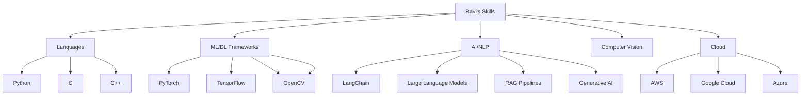

## 👨‍💻 About Me

Hello! I'm Ravi, an AI/ML Engineer passionate about pushing the boundaries of artificial intelligence and machine learning. With a strong foundation in computer vision, natural language processing, and deep learning, I'm on a mission to develop innovative AI solutions that tackle real-world challenges.

- 🎓 Pursuing M.S. in Computer Science at Kansas State University
- 🚀 Experienced in developing cutting-edge AI/ML applications
- 🌱 Always learning and exploring new technologies in the AI space

## 🎓 Education

- **Master of Science in Computer Science**
  Kansas State University, Manhattan, Kansas
  
## 🛠 Technical Skills

## 🏅 Certifications

- OCI Generative-AI Professional, Oracle (2024)
- Multi-Agent-Systems (CrewAI), DeepLearning.AI (2024)
- LangChain for LLM Application Development, DeepLearning.AI (2024)
- Machine Learning Using Python, Vellore Institute of Technology (2022)

## 📫 Let's Connect!

- 📧 Email: vrtteja001@ksu.edu
- 💼 LinkedIn: [Ravi Teja Vempati](https://www.linkedin.com/in/ravi-teja-vempati-801204169)

---

  

